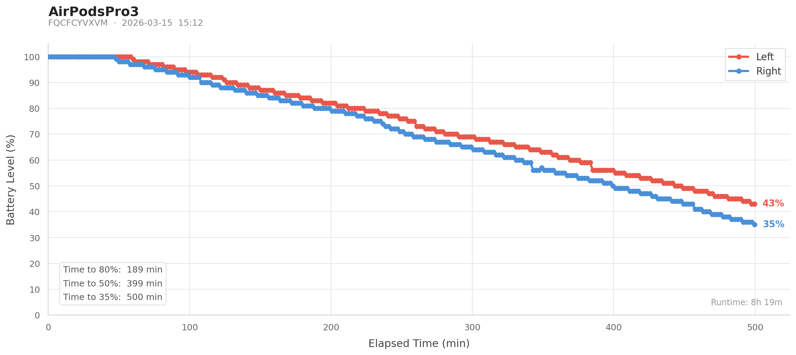
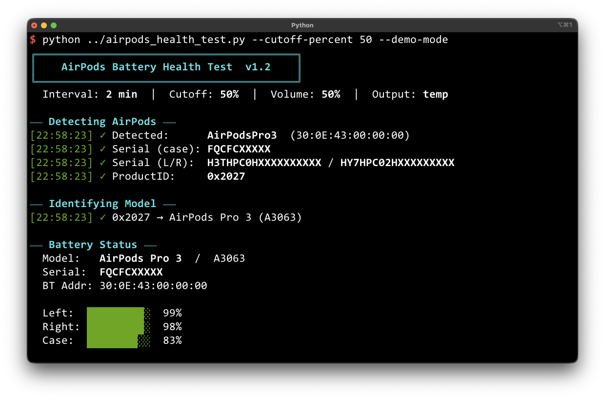
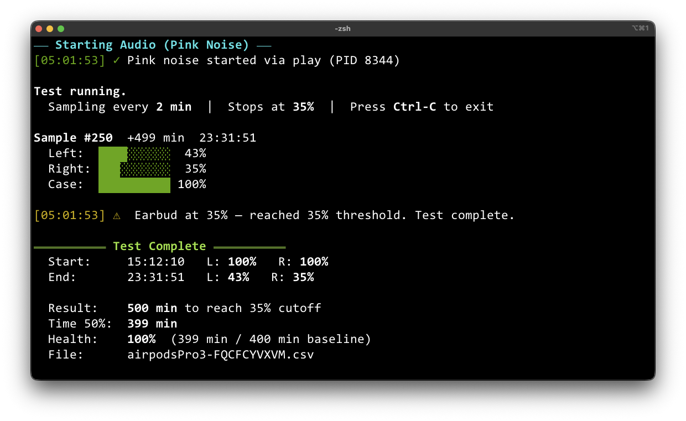

# AirPods Battery Health Test

A macOS CLI tool for characterizing AirPods battery health. Runs a standardized discharge test — normalized volume, pink noise playback, automatic sampling — and logs results to a CSV. A companion visualizer generates a clean battery-over-time graph.



## How it works

1. **Detects** your connected AirPods via `SwitchAudioSource` + `system_profiler`
2. **Normalizes** test conditions — sets volume to 50%, plays pink noise continuously
3. **Samples** battery levels every 2 minutes via `system_profiler SPBluetoothDataType -json`
4. **Stops** automatically when either earbud reaches the cutoff (default 35%)
5. **Logs** every sample to a CSV named after your device and serial number

> **Note on Battery Health Score:** To calculate a meaningful health score, we need reference runtimes from brand-new devices at 100% battery health. The goal is to compile known runtimes to 50% charge for every AirPods model — this will be an ongoing effort as more data is contributed.


## Requirements

- macOS Ventura / Sonoma / Sequoia / Tahoe
- Python 3.9+

```bash
brew install switchaudio-osx   # device detection (required)
brew install sox               # pink noise (required)
pip3 install matplotlib seaborn  # for graph_csv.py
```


## Files

| File | Description |
|---|---|
| `airpods_health_test.py` | Main test runner |
| `graph_csv.py` | Battery graph visualizer |


## Usage

### Run a test

1. Connect your AirPods and select them as your sound output device
2. Then run:

```bash
python3 airpods_health_test.py
```

The script auto-detects your AirPods, checks prerequisites, and walks through setup before starting the test loop.



### Options

```
--cutoff-percent <pct>    Stop when either earbud reaches this   (default: 35%)
--interval <min>          Minutes between samples                (default: 2 min)
--volume <pct>            Playback volume during test            (default: 50%)
--skip-ear-detection      Skip the Disable Automatic Ear Detection prompt
--output-dir <dir>        Directory to write the CSV             (default: current dir)
--serial <SN>             Case serial number (skips prompt if auto-detection fails)
--debug                   Print raw device JSON keys and values
```

### Examples

```bash
# Basic run — auto-detects everything
python3 airpods_health_test.py

# Skip the ear detection prompt (if already disabled)
python3 airpods_health_test.py --skip-ear-detection

# Custom interval, cutoff, and output folder
python3 airpods_health_test.py --interval 2 --cutoff-percent 35 --output-dir ~/AirPodsTests

# Override serial number manually (it should be detected automatically)
python3 airpods_health_test.py --serial DD609JF2M7
```


## Output

CSV files are named automatically as `[modelName]-[serial].csv`, e.g.:

```
airpodsPro3-FQCFCYVXVM.csv
```

If a file with that name already exists, results are **appended** to it rather than overwriting — so multiple test sessions are preserved in a single file.

### CSV columns

| Column | Description |
|---|---|
| `timestamp` | Wall-clock time of sample |
| `model_name` | e.g. `AirPods Pro 3` |
| `model_number` | e.g. `A3063` |
| `serial_case` | Case serial number |
| `serial_left` | Left earbud serial |
| `serial_right` | Right earbud serial |
| `bt_address` | Bluetooth MAC address |
| `left_pct` | Left earbud battery % |
| `right_pct` | Right earbud battery % |
| `case_pct` | Case battery % |
| `elapsed_min` | Minutes since test start |


## Test summary

At the end of each run:



```
  Start:        23:13:09   L: 95%   R: 94%
  End:          23:25:14   L: 95%   R: 93%

  Result:       12 min to reach 35% cutoff
  Time to 50%:  not reached
  File:         airpodsPro3-FQCFCYVXVM.csv
```


## Battery Health Score

If the test ran long enough to reach 50% and the model has a known **100% Health Baseline**, a Battery Health score is shown:

```
  Result:       499 min to reach 35% cutoff
  Time to 50%:  240 min
  Health:       88%  (240 min / 400 min baseline)
  File:         airpodsPro3-XXXXXXXX.csv
```

**Battery Health** is defined as:

```
Health = (test subject's time to reach 50%) / (baseline time to reach 50%)
```

Where the baseline is the runtime of a factory-fresh device at 100% battery health. This baseline needs to be compiled per model — see [Planned Features](#planned-features).

Currently only **AirPods Pro 3** has a baseline checked in (400 min).


## Visualizer

```bash
python3 graph_csv.py <csv_file> [--output-dir <dir>]
```

### Examples

```bash
# Graph saved to current directory
python3 graph_csv.py airpodsPro3-FQCFCYVXVM.csv

# Save graph to Desktop
python3 graph_csv.py airpodsPro3-FQCFCYVXVM.csv --output-dir ~/Desktop
```

Output file is named `graph_<csv_name>.png`.

The graph is useful for checking the discharge curve linearity and comparing Left vs Right earbud discharge deltas.

### Statistics

The lower-left box shows threshold times calculated from the session data. Lines are shown conditionally — 50% and 35% only appear if the session actually reached those levels:

```
Time to 80%:  189 min
Time to 50%:  399 min
Time to 35%:  500 min
```

### Multi-session support

If the same CSV contains multiple test sessions (gap > 10 minutes between consecutive rows), you'll be prompted to select one:

```
Found 2 sessions:

  [1]  2026-03-14 18:46 – 22:47  (4h 0m, 49 samples)   L: 100%→49%   R: 99%→49%
  [2]  2026-03-14 22:50 – 00:10  (1h 20m, 17 samples)  L: 49%→30%    R: 49%→28%

Select session [1–2]:
```


## Supported models

| Product ID | Model | Model Number | Baseline to 50% |
|---|---|---|---|
| `0x2002` | AirPods 1 | A1523 | TBD |
| `0x200F` | AirPods 2 | A2031 | TBD |
| `0x2013` | AirPods 3 | A2565 | TBD |
| `0x2019` | AirPods 4 | A3053 | TBD |
| `0x201B` | AirPods 4 ANC | A3056 | TBD |
| `0x200E` | AirPods Pro 1 | A2084 | TBD |
| `0x2014` | AirPods Pro 2 (Lightning) | A2699 | TBD |
| `0x2024` | AirPods Pro 2 (USB-C) | A3047 | TBD |
| `0x2027` | AirPods Pro 3 | A3063 | 400 min |
| `0x200A` | AirPods Max 1 | A2096 | TBD |
| `0x201F` | AirPods Max 2 | A3184 | TBD |

Model numbers sourced from [Apple Support](https://support.apple.com/en-us/109525).


## Before running

**Disable Automatic Ear Detection** to prevent playback pausing if the AirPods are set down during a long test:

1. System Settings → Bluetooth
2. Click **ⓘ** next to your AirPods → *AirPods Settings...*
3. Toggle **OFF** Automatic Ear Detection

Or pass `--skip-ear-detection` if it's already off.


## Notes

- Battery data is read from `system_profiler SPBluetoothDataType -json`, which requires the AirPods to be connected as the active audio output
- **Why default --cutoff-percent 35?** Lithium-ion batteries are healthiest when kept between 30–70%. Stopping at 35% feels like a safe buffer (readings may lag and/or battery may continue to sag a bit)
- **Why default --volume 50?** This matches the methodology used by Apple and RTings for runtime benchmarking — and it won't accidentally blow out your eardrums


## Limitations

- **macOS only.** This project relies on `system_profiler`, `osascript`, and `SwitchAudioSource` — system-level APIs unavailable on iOS due to sandboxing restrictions. A Mac is required to run the test. If you know of a way to achieve equivalent functionality on iOS, please reach out.


## Planned Features

- **Battery Health baseline database** — crowdsourcing factory-fresh 50% runtimes for all AirPods models. If you have a brand-new pair of AirPods, running this test and sharing your results would directly help build out this reference. Currently only AirPods Pro 3 has a baseline (400 min).

- **Homebrew formula** — standalone installer so the tool can be installed with `brew install airpods-health-test` without any manual setup.